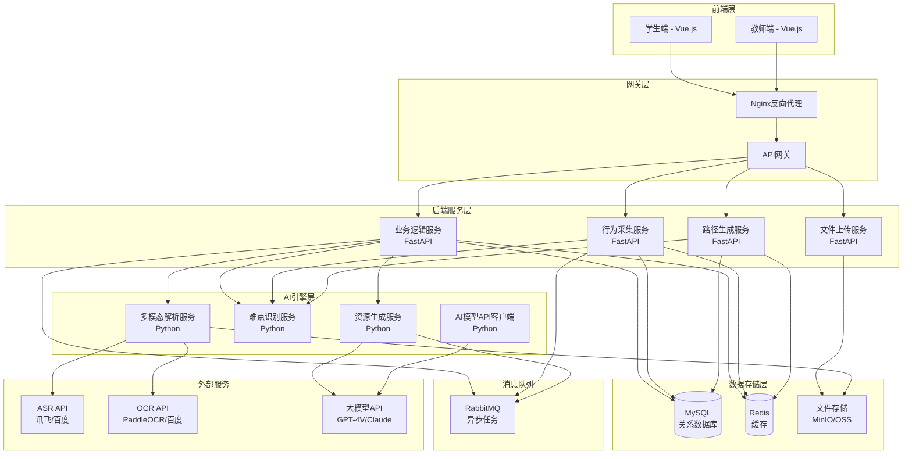
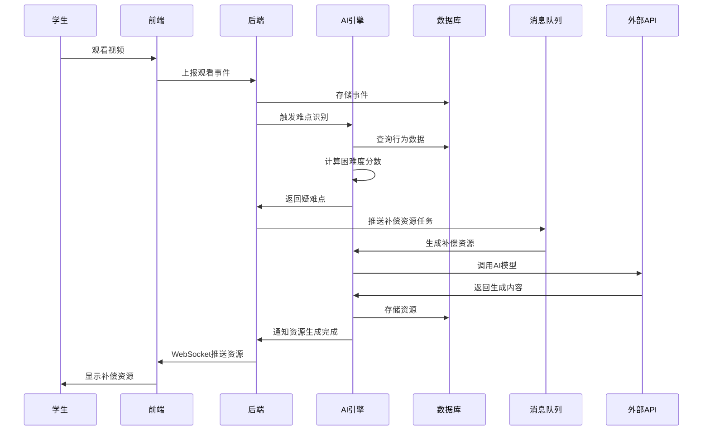
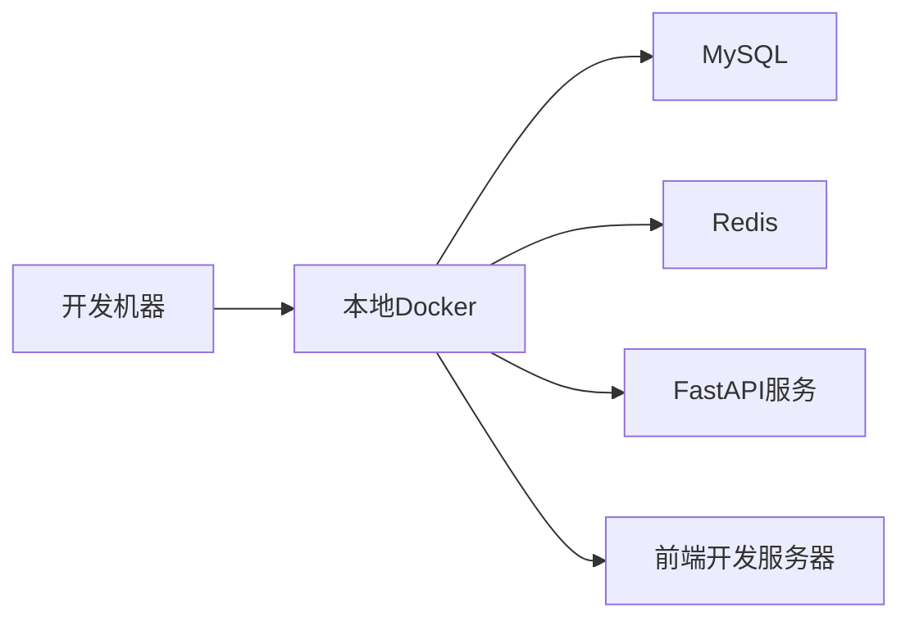
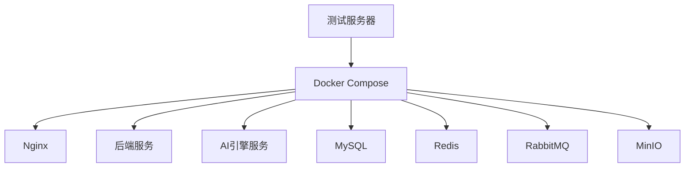
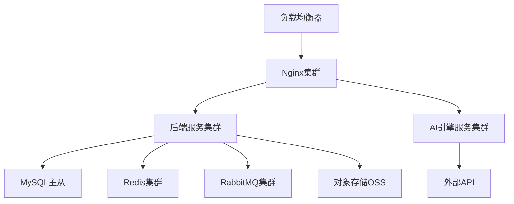

# AI赋能职教视频个性化教学系统 - 系统架构设计文档

## 文档信息
- **版本**: v1.0
- **编写日期**: 2025-01-25
- **编写人**: 周东吴（队长）
- **文档状态**: 初稿

---

## 1. 系统概述

### 1.1 系统定位
AI赋能职教视频个性化教学系统是一个以主动智能补偿为核心的教学视频个性化学习支持系统，通过多模态分析学习者的观看行为，自动识别知识薄弱点并主动推送高质量补偿资源。

### 1.2 核心特性
- **多模态视频解析**：ASR语音识别 + OCR文字识别 + 知识点自动切分
- **智能难点识别**：基于观看行为数据（回放、暂停、停留时长等）自动识别疑难点
- **个性化学习路径**：根据学生掌握状态和知识点依赖关系生成定制化学习路径
- **主动补偿推送**：在5分钟内主动推送知识卡片、练习题、微视频等补偿资源
- **实时学情分析**：为教师提供班级学情统计和公共难点识别

---

## 2. 系统分层架构

### 2.1 架构图（Mermaid格式）

---

## 3. 各层详细设计

### 3.1 前端层

#### 3.1.1 学生端（Vue.js 3 + TypeScript）
- **技术栈**：
  - 框架：Vue.js 3 + Composition API
  - UI组件库：Element Plus
  - 状态管理：Pinia
  - 路由：Vue Router
  - 视频播放器：Video.js / DPlayer
  - 可视化：ECharts
  - HTTP客户端：Axios

- **核心页面**：
  - 视频播放页：视频播放器 + 知识点目录 + 行为事件采集
  - 补偿资源页：知识卡片展示 + 练习题 + 微视频播放
  - 学习路径页：路径可视化 + 进度展示 + 下一步建议
  - 个人中心：学习统计 + 疑难点列表

#### 3.1.2 教师端（Vue.js 3 + TypeScript）
- **技术栈**：与学生端相同
- **核心页面**：
  - 教学效果仪表盘：班级学情统计 + 疑难知识点排行 + 热力图
  - 教师标注工作台：知识点编辑 + 知识点边界调整 + 术语库管理
  - 资源审核：补偿资源审核 + 质量评估

### 3.2 网关层

#### 3.2.1 Nginx反向代理
- **功能**：
  - 静态资源服务（前端构建产物）
  - 反向代理到后端服务
  - 负载均衡
  - SSL/TLS终止
  - 请求限流

#### 3.2.2 API网关
- **功能**：
  - 统一API入口
  - 认证授权（JWT验证）
  - 请求路由
  - 请求/响应日志
  - 接口限流

### 3.3 后端服务层

#### 3.3.1 业务逻辑服务（FastAPI）
- **技术栈**：
  - 框架：FastAPI
  - ORM：SQLAlchemy
  - 数据库：MySQL/PostgreSQL
  - 缓存：Redis
  - 认证：JWT

- **核心模块**：
  - 用户管理：注册、登录、权限控制
  - 视频管理：上传、列表、详情、删除
  - 知识点管理：查询、编辑、依赖关系
  - 学习路径管理：生成、查询、更新

#### 3.3.2 行为采集服务（FastAPI）
- **核心功能**：
  - 接收观看事件（play/pause/seek/replay）
  - 批量上报处理
  - 事件存储和统计分析
  - 实时难点识别触发

#### 3.3.3 路径生成服务（FastAPI）
- **核心功能**：
  - 调用算法模块生成学习路径
  - 路径查询和更新
  - 掌握状态管理
  - 下一步学习建议

#### 3.3.4 文件上传服务（FastAPI）
- **核心功能**：
  - 大文件分片上传
  - 视频文件存储（MinIO/OSS）
  - 文件上传进度跟踪
  - 文件访问URL生成

### 3.4 AI引擎层

#### 3.4.1 多模态解析服务（Python）
- **技术栈**：
  - 框架：FastAPI（提供API接口）
  - ASR：讯飞/百度API
  - OCR：PaddleOCR/百度OCR
  - 文本处理：jieba、sentence-transformers
  - 图算法：networkx

- **核心功能**：
  - 视频ASR转写（带时间戳）
  - 视频OCR识别（PPT、板书）
  - 知识点自动切分
  - 知识点自动标注（名称、摘要、关键词、难度）
  - 知识图谱构建

#### 3.4.2 难点识别服务（Python）
- **核心功能**：
  - 基于观看行为数据识别疑难点
  - 困难度分数计算
  - 公共难点识别（多人困难的知识点）
  - 个体弱项诊断

#### 3.4.3 资源生成服务（Python）
- **核心功能**：
  - 知识卡片生成（调用AI模型）
  - 练习题自动生成（调用AI模型）
  - 微视频生成（智能剪辑或AI生成）
  - 资源质量评估

#### 3.4.4 AI模型API客户端（Python）
- **功能**：
  - 统一封装多模态大模型API（GPT-4V、Claude、文心一言）
  - API调用重试和限流处理
  - 结果缓存
  - 批量处理优化

### 3.5 数据存储层

#### 3.5.1 MySQL/PostgreSQL（关系数据库）
- **存储内容**：
  - 用户信息
  - 视频信息
  - 知识点信息
  - 观看事件
  - 掌握状态
  - 补偿资源
  - 学习路径

#### 3.5.2 Redis（缓存）
- **存储内容**：
  - 用户Session
  - API响应缓存
  - AI模型结果缓存
  - 热点数据缓存
  - 分布式锁

#### 3.5.3 文件存储（MinIO/OSS）
- **存储内容**：
  - 视频文件
  - 图片文件
  - 知识卡片Markdown
  - 微视频文件

### 3.6 消息队列（RabbitMQ）
- **用途**：
  - 视频解析异步任务
  - 补偿资源生成异步任务
  - 资源推送异步任务
  - 难点识别异步任务

---

## 4. 各层通信方式

### 4.1 前端 ↔ 后端
- **协议**：HTTP/HTTPS
- **格式**：RESTful API + JSON
- **实时通信**：WebSocket（用于实时推送补偿资源）

### 4.2 后端 ↔ AI引擎
- **协议**：HTTP/HTTPS
- **格式**：RESTful API + JSON
- **异步处理**：通过消息队列（RabbitMQ）

### 4.3 后端 ↔ 数据库
- **协议**：TCP/IP
- **ORM**：SQLAlchemy
- **连接池**：SQLAlchemy连接池

### 4.4 AI引擎 ↔ 外部API
- **协议**：HTTP/HTTPS
- **格式**：各API厂商的格式
- **重试机制**：指数退避

---

## 5. 技术选型建议

### 5.1 前端技术栈
| 组件 | 技术选型 | 理由 |
|------|---------|------|
| 框架 | Vue.js 3 | 学习曲线平缓，生态成熟 |
| UI组件库 | Element Plus | 组件丰富，文档完善 |
| 状态管理 | Pinia | Vue 3官方推荐 |
| 视频播放器 | Video.js | 功能强大，可定制性强 |
| 可视化 | ECharts | 图表类型丰富，性能好 |

### 5.2 后端技术栈
| 组件 | 技术选型 | 理由 |
|------|---------|------|
| Web框架 | FastAPI | 性能好，自动生成API文档，支持异步 |
| ORM | SQLAlchemy | 功能强大，支持多种数据库 |
| 数据库 | PostgreSQL | 功能丰富，支持JSON字段，性能好 |
| 缓存 | Redis | 高性能，支持多种数据结构 |
| 消息队列 | RabbitMQ | 稳定可靠，支持多种消息模式 |

### 5.3 AI引擎技术栈
| 组件 | 技术选型 | 理由 |
|------|---------|------|
| 语言 | Python 3.9+ | AI生态丰富，库多 |
| 中文分词 | jieba | 中文分词效果好 |
| 语义相似度 | sentence-transformers | 支持中文，效果好 |
| 图算法 | networkx | 功能全面，易用 |
| ASR | 讯飞/百度API | 准确率高，支持方言 |
| OCR | PaddleOCR | 开源免费，准确率高 |
| 大模型 | GPT-4V/Claude | 多模态能力强 |

### 5.4 基础设施
| 组件 | 技术选型 | 理由 |
|------|---------|------|
| 反向代理 | Nginx | 性能好，功能全面 |
| 容器化 | Docker | 标准化部署 |
| 编排 | Docker Compose | 简单易用 |
| 文件存储 | MinIO | 开源，S3兼容 |

---

## 6. 关键组件职责划分

### 6.1 前端组件
- **VideoPlayer组件**：视频播放，行为事件采集
- **KnowledgePointList组件**：知识点目录展示
- **RemedialResourceCard组件**：补偿资源展示
- **LearningPathVisualization组件**：学习路径可视化
- **StatisticsDashboard组件**：学情统计仪表盘

### 6.2 后端服务
- **UserService**：用户管理、认证授权
- **VideoService**：视频管理、知识点查询
- **WatchEventService**：行为事件采集、统计分析
- **DifficultyDetectionService**：难点识别服务
- **LearningPathService**：学习路径生成和管理
- **ResourceService**：补偿资源管理

### 6.3 AI算法模块
- **KnowledgePointSegmenter**：知识点切分算法
- **KnowledgePointAnnotator**：知识点自动标注
- **KnowledgeGraphBuilder**：知识图谱构建
- **DifficultyDetector**：难点识别算法
- **PublicDifficultyDetector**：公共难点识别
- **LearningPathGenerator**：学习路径生成算法
- **PathAdjuster**：路径动态调整
- **KnowledgeCardGenerator**：知识卡片生成
- **ExerciseGenerator**：练习题生成

---

## 7. 数据流向图

---

## 8. 部署架构图

### 8.1 开发环境

### 8.2 测试环境

### 8.3 生产环境

---

## 9. 性能与扩展性设计

### 9.1 高并发支持（1000+并发用户）
- **前端**：CDN加速静态资源
- **网关**：Nginx负载均衡
- **后端**：多实例部署，无状态设计
- **数据库**：读写分离，连接池优化
- **缓存**：Redis缓存热点数据
- **异步处理**：耗时任务异步化（视频解析、资源生成）

### 9.2 大文件上传支持
- **分片上传**：前端分片，后端合并
- **断点续传**：支持上传中断后继续
- **直接上传OSS**：大文件直接上传到对象存储，减少服务器压力

### 9.3 AI模型调用异步处理
- **消息队列**：AI任务通过RabbitMQ异步处理
- **任务状态跟踪**：通过Redis存储任务状态
- **结果缓存**：相同输入的结果缓存，避免重复调用

### 9.4 系统扩展性
- **微服务架构**：各服务独立部署，可独立扩展
- **水平扩展**：支持多实例部署，通过负载均衡分发
- **数据库分库分表**：观看事件表可按时间分表
- **缓存分层**：本地缓存 + Redis缓存

---

## 10. 安全设计

### 10.1 认证授权
- **JWT Token**：用户登录后获取JWT Token
- **Token刷新**：支持Token刷新机制
- **权限控制**：基于角色的访问控制（RBAC）

### 10.2 数据安全
- **密码加密**：使用bcrypt加密存储
- **敏感信息**：API密钥等敏感信息使用环境变量
- **SQL注入防护**：使用ORM，避免直接SQL拼接
- **XSS防护**：前端输入输出转义

### 10.3 接口安全
- **HTTPS**：所有接口使用HTTPS
- **接口限流**：防止接口被恶意调用
- **请求验证**：所有请求参数验证

---

## 11. 监控与日志

### 11.1 日志
- **应用日志**：使用Python logging记录
- **访问日志**：Nginx访问日志
- **错误日志**：集中收集错误日志
- **日志存储**：使用ELK或类似方案

### 11.2 监控
- **性能监控**：API响应时间、数据库查询时间
- **资源监控**：CPU、内存、磁盘使用率
- **业务监控**：视频解析成功率、难点识别准确率
- **告警**：异常情况自动告警

---

## 12. 下一步工作

1. ✅ 系统架构设计（本文档）
2. ⏳ 数据库ER图设计
3. ⏳ API接口规范设计
4. ⏳ 开发规范和代码规范制定
5. ⏳ 项目目录结构创建
6. ⏳ 开发环境搭建

---

**文档版本**: v1.0  
**最后更新**: 2025-01-25  
**下次评审**: 待定
